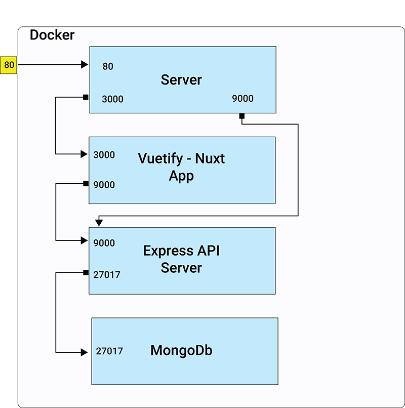

# mevn-todo-demo
This is a simple Todo demo project based on the MEVN stack (Mongo Express Vuetify Nuxt)

Containers:
- todo_vue_client - the Nuxt / Vuetify client
- todo_node_server - Serves the REST api
- MongoDB - standard Mongo offical container
- reverse_proxy - Nginx server performing reverse proxy role

Setup:
- Clone the code
- Install build and dev dependencies

Running test:

- Build and push to local Docker desktop:
      
  - docker-compose build
  - docker-compose up
  
Then run the test:

  - run completeFourSteps.js in the Cypress app
  
  This is a quick smoke test, checks the full CRUD operations 
  by creating, reading, updating and deleting 4 todo items.

    cd client
    
    // run the Cypress app from the commandline ->
    
    ./node_modules/.bin/cypress open
